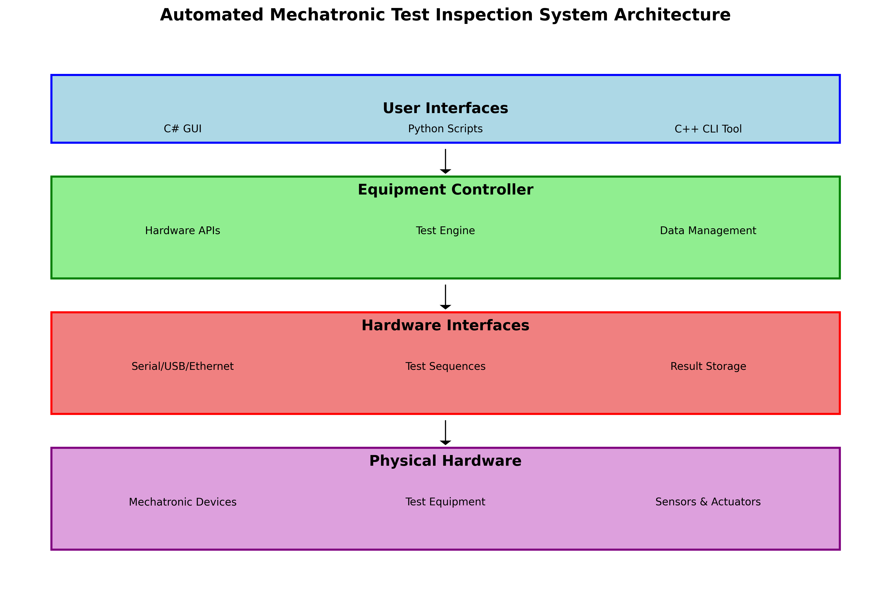
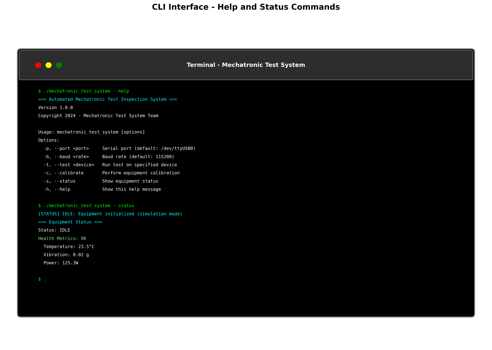

# Automated Mechatronic Test Inspection System



## Overview

The Automated Mechatronic Test Inspection System is a comprehensive testing and inspection platform designed for mechatronic devices in cleanroom environments. The system provides automated testing capabilities, real-time monitoring, and detailed reporting through multiple interfaces including C++, C#, and Python.

### Key Features

- **Multi-Interface Support**: C++ CLI tool, C# GUI application, and Python scripting interfaces
- **Automated Testing**: Runs predefined test sequences on multiple devices simultaneously
- **Real-time Monitoring**: Continuous health monitoring and status reporting
- **Data Management**: Comprehensive test result recording, analysis, and reporting
- **Computer Vision Integration**: Optional visual inspection capabilities
- **Simulation Mode**: Training and development environment without hardware requirements
- **Cleanroom Compatible**: Designed for use in controlled manufacturing environments

## Quick Start

### Installation

```bash
# Clone the repository
git clone https://github.com/riteshr19/-Automated-Mechatronic-Test-Inspection-System.git
cd -Automated-Mechatronic-Test-Inspection-System

# Build the system
mkdir build && cd build
cmake ..
make -j$(nproc)

# Run tests
make test
```

For detailed installation instructions, see the [Installation Guide](docs/INSTALLATION_GUIDE.md).

### Basic Usage

```bash
# Check system status
./build/mechatronic_test_system --status

# Run calibration
./build/mechatronic_test_system --calibrate

# Test a device
./build/mechatronic_test_system --test DEVICE_001

# Get help
./build/mechatronic_test_system --help
```



## Documentation

### User Guides
- **[Installation Guide](docs/INSTALLATION_GUIDE.md)** - Step-by-step setup instructions with screenshots
- **[CLI Guide](docs/CLI_GUIDE.md)** - Comprehensive command-line interface documentation
- **[Operator Guide](docs/operator/operator_guide.md)** - Daily operation procedures for production environments
- **[Technical Manual](docs/technical/technical_manual.md)** - Detailed system architecture and development information

### Visual Documentation
- **System Architecture**: Comprehensive diagrams and flowcharts
- **Installation Screenshots**: Step-by-step visual installation guide
- **CLI Usage Examples**: Terminal screenshots showing command usage
- **Test Execution**: Visual documentation of testing procedures


## System Architecture

The system follows a modular architecture with these key components:

- **User Interfaces**: C# GUI, Python scripts, C++ CLI tool
- **Equipment Controller**: Core control logic and hardware abstraction
- **Hardware Interfaces**: Serial, USB, and Ethernet communication layers
- **Test Engine**: Automated test sequence execution and validation
- **Data Management**: Result storage, reporting, and analysis

## Development

### Build Process


#### Prerequisites
- CMake 3.16+
- C++17 compatible compiler (GCC 7+, Clang 7+, MSVC 2019+)
- Python 3.8+

#### Building
```bash
mkdir build && cd build
cmake ..
make -j$(nproc)
```

#### Running Tests
```bash
make test
```


### Code Structure

```
src/
├── cpp/                 # C++ core library and CLI application
│   ├── main.cpp
│   └── equipment_controller.cpp
├── python/              # Python integration layer
│   ├── equipment_controller.py
│   └── test_automation.py
└── csharp/              # C# GUI application
    └── EquipmentController.cs

tests/
├── unit/                # Unit tests
└── integration/         # Integration tests

docs/
├── images/              # Screenshots and diagrams
├── technical/           # Technical documentation
└── operator/            # Operator guides
```

## Contributing

### Development Workflow
1. Fork the repository
2. Create a feature branch
3. Make changes with appropriate tests
4. Ensure all tests pass
5. Submit a pull request

### Code Standards
- **C++**: Follow Google C++ Style Guide
- **Python**: Follow PEP 8 with type hints
- **C#**: Follow Microsoft C# conventions
- **Documentation**: Use Markdown with clear screenshots and examples

## Testing

The system includes comprehensive testing at multiple levels:

- **Unit Tests**: 10 tests covering core functionality (100% pass rate)
- **Integration Tests**: 5 tests covering system workflows (100% pass rate)
- **System Tests**: Manual verification procedures


## License

This project is licensed under the Apache License 2.0. See [LICENSE](LICENSE) for details.

## Support

### Getting Help
- **Installation Issues**: See [Installation Guide](docs/INSTALLATION_GUIDE.md)
- **Usage Questions**: See [CLI Guide](docs/CLI_GUIDE.md) or [Operator Guide](docs/operator/operator_guide.md)
- **Technical Details**: See [Technical Manual](docs/technical/technical_manual.md)
- **Bug Reports**: Create an issue on GitHub

### Contact
- **Development Team**: See repository contributors
- **Technical Support**: Create an issue with detailed system information

---

**Project Goals**
1. Design and build test setups, hardware integrations, and software solutions
2. Develop equipment control software using C/C++/C# and integrate LabVIEW/scripting
3. Learn and maintain the codebase: testing, debugging, continuous improvements
4. Create and run unit tests in a simulation environment
5. Gather and document user requirements (Engineering, Process, Customer teams)
6. Provide technical support, troubleshoot integration issues
7. Write/update operator guides, technical manuals, and training docs
8. Perform daily hands-on testing (2–4 hrs) in a cleanroom environment
9. Support domestic deployment/troubleshooting

**Skills Applied**
- C/C++/C# development
- LabVIEW + scripting (Python, MATLAB, etc.)
- Mechatronics & automation
- Computer vision (optional module)
- Software documentation & coding standards
