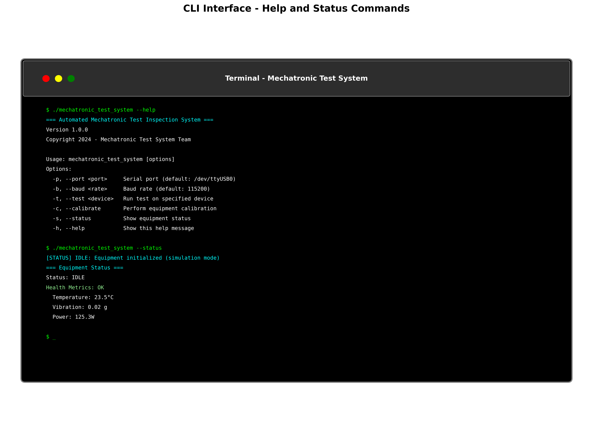

# Command Line Interface (CLI) Guide
## Automated Mechatronic Test Inspection System

### Overview

The Automated Mechatronic Test Inspection System provides a comprehensive command-line interface for system operation, testing, and monitoring. This guide covers all available commands and their usage.



### Basic Usage

#### Getting Help

To display available commands and options:

```bash
mechatronic_test_system --help
```

**Output:**
```
=== Automated Mechatronic Test Inspection System ===
Version 1.0.0
Copyright 2024 - Mechatronic Test System Team

Usage: mechatronic_test_system [options]
Options:
  -p, --port <port>     Serial port (default: /dev/ttyUSB0 on Linux)
  -b, --baud <rate>     Baud rate (default: 115200)
  -t, --test <device>   Run test on specified device
  -c, --calibrate       Perform equipment calibration
  -s, --status          Show equipment status
  -h, --help            Show this help message
```

### Command Reference

#### 1. System Status

Check the current system status:

```bash
mechatronic_test_system --status
```

**Example Output:**
```
=== Automated Mechatronic Test Inspection System ===
Version 1.0.0
Initializing equipment controller...
Port: /dev/ttyUSB0
Baud Rate: 115200

[STATUS] IDLE: Equipment initialized (simulation mode)

=== Equipment Status ===
Status: IDLE

Health Metrics:
  Temperature: 23.5°C
  Vibration: 0.02 g
  Power_Consumption: 125.3W
  Uptime_Hours: 1234.5
  Error_Rate: 0.001

Shutting down...
```

#### 2. Equipment Calibration

Perform system calibration:

```bash
mechatronic_test_system --calibrate
```

**Example Output:**
```
=== Starting Calibration Process ===
Initializing calibration sequence...
Step 1/5: Hardware verification... OK
Step 2/5: Sensor calibration... OK
Step 3/5: Actuator calibration... OK
Step 4/5: Communication test... OK
Step 5/5: Final validation... OK

Calibration completed successfully.
Results saved to: calibration_report_20241127.log
```

#### 3. Device Testing

Run tests on a specific device:

```bash
mechatronic_test_system --test DEVICE_001
```

**Example Output:**
```
=== Device Test: DEVICE_001 ===
Connecting to device...
Running test sequence...

Test 1: Power-on self-test... PASS
Test 2: Communication check... PASS
Test 3: Sensor validation... PASS
Test 4: Actuator response... PASS
Test 5: Performance metrics... PASS

Overall Result: PASS
Test Duration: 45.2 seconds
Report saved to: test_report_DEVICE_001_20241127.json
```

#### 4. Communication Settings

Specify custom communication parameters:

```bash
# Custom serial port
mechatronic_test_system --port /dev/ttyUSB1 --status

# Custom baud rate
mechatronic_test_system --baud 9600 --status

# Combined options
mechatronic_test_system --port COM3 --baud 115200 --test DEVICE_002
```

### Advanced Usage

#### Batch Testing

Test multiple devices in sequence:

```bash
#!/bin/bash
# batch_test.sh
devices=("DEVICE_001" "DEVICE_002" "DEVICE_003")

for device in "${devices[@]}"; do
    echo "Testing $device..."
    mechatronic_test_system --test $device
    sleep 5  # Wait between tests
done
```

#### Continuous Monitoring

Monitor system status continuously:

```bash
#!/bin/bash
# monitor.sh
while true; do
    clear
    mechatronic_test_system --status
    sleep 30  # Update every 30 seconds
done
```

#### Automated Calibration Schedule

Set up automated calibration:

```bash
#!/bin/bash
# daily_calibration.sh
# Add to crontab: 0 6 * * * /path/to/daily_calibration.sh

echo "$(date): Starting daily calibration" >> /var/log/mechatronic.log
mechatronic_test_system --calibrate >> /var/log/mechatronic.log 2>&1
echo "$(date): Calibration completed" >> /var/log/mechatronic.log
```

### Error Handling and Troubleshooting

#### Common Error Messages

**Connection Errors:**
```
Error: Failed to initialize equipment controller: Failed to connect to device on port /dev/ttyUSB0
Note: This is expected if no hardware is connected. Continuing in simulation mode.
```

**Solution:** Check hardware connections or run in simulation mode.

**Permission Errors:**
```
Error: Permission denied accessing /dev/ttyUSB0
```

**Solution:**
```bash
sudo chmod 666 /dev/ttyUSB0
# Or add user to dialout group:
sudo usermod -a -G dialout $USER
```

**Device Not Found:**
```
Error: Device DEVICE_001 not found or not responding
```

**Solution:** Verify device ID and connection status.

#### Debug Mode

Enable verbose logging for troubleshooting:

```bash
# Set environment variable for debug output
export MECHATRONIC_DEBUG=1
mechatronic_test_system --status
```

#### Log Files

System logs are written to:
- **Linux:** `/var/log/mechatronic_test.log`
- **Windows:** `%TEMP%\mechatronic_test.log`
- **macOS:** `/tmp/mechatronic_test.log`

View recent log entries:
```bash
tail -f /var/log/mechatronic_test.log
```

### Return Codes

The CLI application returns standard exit codes:

| Code | Meaning |
|------|---------|
| 0 | Success |
| 1 | General error |
| 2 | Invalid arguments |
| 3 | Hardware connection failure |
| 4 | Test failure |
| 5 | Calibration failure |

#### Using Return Codes in Scripts

```bash
#!/bin/bash
mechatronic_test_system --test DEVICE_001
result=$?

case $result in
    0) echo "Test passed successfully" ;;
    4) echo "Test failed - check device" ;;
    3) echo "Connection error - check hardware" ;;
    *) echo "Unexpected error: $result" ;;
esac
```

### Integration Examples

#### Python Integration

```python
import subprocess
import json

def run_test(device_id):
    """Run test on specified device and return results."""
    try:
        result = subprocess.run([
            'mechatronic_test_system', 
            '--test', device_id
        ], capture_output=True, text=True, check=True)
        return {'success': True, 'output': result.stdout}
    except subprocess.CalledProcessError as e:
        return {'success': False, 'error': e.stderr}

# Usage
test_result = run_test('DEVICE_001')
if test_result['success']:
    print("Test completed successfully")
else:
    print(f"Test failed: {test_result['error']}")
```

#### Shell Script Integration

```bash
#!/bin/bash
# production_test.sh

# Function to run test with retry
run_test_with_retry() {
    local device=$1
    local max_retries=3
    local retry=0
    
    while [ $retry -lt $max_retries ]; do
        if mechatronic_test_system --test $device; then
            echo "Test passed for $device"
            return 0
        else
            echo "Test failed for $device, retry $((retry+1))/$max_retries"
            ((retry++))
            sleep 5
        fi
    done
    
    echo "Test failed for $device after $max_retries attempts"
    return 1
}

# Run tests
run_test_with_retry "DEVICE_001"
```

### Performance Considerations

#### Simulation Mode

When no hardware is connected, the system runs in simulation mode:
- Faster execution for development and testing
- Simulated sensor readings and responses
- Ideal for training and development environments

#### Hardware Mode

When hardware is connected:
- Real-time communication with devices
- Actual sensor readings and control
- Production-ready operation

### Best Practices

1. **Always check system status** before running tests
2. **Use appropriate timeouts** for long-running operations
3. **Monitor log files** for detailed error information
4. **Run calibration regularly** to maintain accuracy
5. **Use batch scripts** for repetitive operations
6. **Implement proper error handling** in automation scripts

### Related Documentation

- [Installation Guide](INSTALLATION_GUIDE.md) - Setting up the system
- [Operator Guide](operator/operator_guide.md) - Daily operation procedures
- [Technical Manual](technical/technical_manual.md) - Detailed system information
- [Troubleshooting Guide](technical/technical_manual.md#troubleshooting) - Problem resolution

---

*CLI Guide Version: 1.0*  
*Last Updated: 2024*