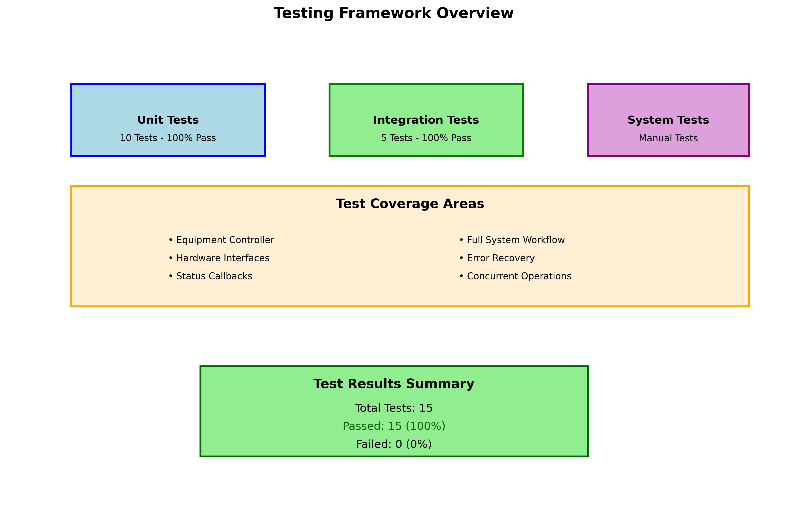

# Documentation Index
## Automated Mechatronic Test Inspection System


### Welcome to the Documentation Center

This is your complete guide to the Automated Mechatronic Test Inspection System. All documentation includes screenshots, step-by-step procedures, and visual aids to ensure clear understanding and proper implementation.

---

## 📚 Quick Navigation

### 🚀 Getting Started
| Document | Description | Audience |
|----------|-------------|----------|
| **[README](../README.md)** | Project overview and quick start | All users |
| **[Installation Guide](INSTALLATION_GUIDE.md)** | Complete setup with screenshots | System administrators |
| **[CLI Guide](CLI_GUIDE.md)** | Command-line interface documentation | Operators and developers |

### 👩‍💼 For Operators
| Document | Description | Visual Content |
|----------|-------------|----------------|
| **[Operator Guide](operator/operator_guide.md)** | Daily operation procedures | ✅ Step-by-step screenshots |
| **[Safety Procedures](operator/operator_guide.md#safety-procedures)** | Safety protocols and emergency procedures | ✅ Safety diagrams |
| **[Troubleshooting Guide](TROUBLESHOOTING_GUIDE.md)** | Problem resolution with examples | ✅ Error screenshots and solutions |

### 🔧 For Developers
| Document | Description | Technical Content |
|----------|-------------|-------------------|
| **[Technical Manual](technical/technical_manual.md)** | Architecture and development guide | ✅ System diagrams and code examples |
| **[API Documentation](technical/technical_manual.md#api-documentation)** | Programming interfaces | ✅ Code snippets and examples |
| **[Testing Framework](technical/technical_manual.md#testing-framework)** | Test procedures and validation | ✅ Test execution screenshots |

---

## 🖼️ Visual Documentation Overview

### Screenshots and Diagrams

All documentation includes comprehensive visual aids:

#### 🏗️ System Architecture

- Complete system component overview
- Data flow diagrams
- Interface relationships

#### 🖥️ Command Line Interface

- Help command output
- Status monitoring examples
- Error message illustrations

#### 🧪 Testing Framework

- Test execution flow
- Result visualization
- Performance metrics

#### 📦 Build Process

- Step-by-step build workflow
- Dependency management
- Installation verification

---

## 📖 Documentation Categories

### Installation and Setup
- **[Installation Guide](INSTALLATION_GUIDE.md)** - Complete installation with screenshots
  - Prerequisites and system requirements
  - Step-by-step build process with visual confirmation
  - Configuration and verification procedures
  - Hardware setup with connection diagrams

### Operation Guides
- **[CLI Guide](CLI_GUIDE.md)** - Command-line interface reference
  - All available commands with examples
  - Output interpretation with screenshots
  - Batch operation scripts
  - Error handling and troubleshooting

- **[Operator Guide](operator/operator_guide.md)** - Production environment procedures
  - Daily startup procedures with visual checklists
  - Test execution workflows with screenshots
  - Data management and reporting
  - Maintenance schedules and procedures

### Technical Reference
- **[Technical Manual](technical/technical_manual.md)** - Comprehensive technical documentation
  - System architecture with detailed diagrams
  - Software components and interfaces
  - Development guidelines and standards
  - API documentation with code examples

### Problem Resolution
- **[Troubleshooting Guide](TROUBLESHOOTING_GUIDE.md)** - Comprehensive problem resolution
  - Common issues with visual examples
  - Step-by-step troubleshooting procedures
  - Error message interpretation
  - Performance optimization guidelines

---

## 🎯 Documentation Features

### ✅ What's Included in Every Guide

| Feature | Description | Benefit |
|---------|-------------|---------|
| **Screenshots** | Actual system output and interfaces | Visual confirmation of correct procedures |
| **Step-by-step procedures** | Detailed instructions with checkboxes | Ensures nothing is missed |
| **Code examples** | Working code snippets | Copy-paste ready solutions |
| **Error handling** | Common problems and solutions | Faster issue resolution |
| **Visual diagrams** | System architecture and workflows | Better understanding of system design |

### 📱 Responsive Design
- All documentation works on desktop and mobile devices
- High-resolution images scale appropriately
- Clear typography for easy reading

### 🔍 Search and Navigation
- Comprehensive table of contents in each document
- Cross-references between related sections
- Quick reference tables for common tasks

---

## 🗂️ File Organization

```
docs/
├── images/                          # All screenshots and diagrams
│   ├── architecture/               # System architecture diagrams
│   │   └── system_architecture.png
│   ├── build/                      # Build process visuals
│   │   └── build_process.png
│   ├── cli/                        # Command-line interface screenshots
│   │   ├── cli_help_status.png
│   │   └── status_output.txt
│   ├── installation/               # Installation screenshots
│   │   └── repository_structure.png
│   ├── testing/                    # Test execution and results
│   │   ├── test_execution_output.png
│   │   └── testing_framework.png
│   ├── troubleshooting/           # Error examples and solutions
│   └── gui/                        # GUI application screenshots
│
├── operator/                       # Operator documentation
│   └── operator_guide.md
├── technical/                      # Technical documentation
│   └── technical_manual.md
│
├── INSTALLATION_GUIDE.md           # Installation procedures
├── CLI_GUIDE.md                   # Command-line reference
├── TROUBLESHOOTING_GUIDE.md       # Problem resolution
└── INDEX.md                       # This documentation index
```

---

## 🚀 Quick Start Paths

### For New Users
1. **[Installation Guide](INSTALLATION_GUIDE.md)** - Set up the system
2. **[CLI Guide](CLI_GUIDE.md)** - Learn basic commands
3. **[Operator Guide](operator/operator_guide.md)** - Start using the system

### For Operators
1. **[Operator Guide](operator/operator_guide.md)** - Daily procedures
2. **[CLI Guide](CLI_GUIDE.md)** - Command reference
3. **[Troubleshooting Guide](TROUBLESHOOTING_GUIDE.md)** - Problem resolution

### For Developers
1. **[Technical Manual](technical/technical_manual.md)** - System architecture
2. **[Installation Guide](INSTALLATION_GUIDE.md)** - Development setup
3. **[CLI Guide](CLI_GUIDE.md)** - Testing and debugging

### For Troubleshooting
1. **[Troubleshooting Guide](TROUBLESHOOTING_GUIDE.md)** - Quick solutions
2. **[CLI Guide](CLI_GUIDE.md)** - Diagnostic commands
3. **[Technical Manual](technical/technical_manual.md)** - Deep dive analysis

---

## 📊 Documentation Statistics

| Metric | Value |
|--------|-------|
| **Total Documents** | 7 comprehensive guides |
| **Screenshots** | 8+ high-resolution images |
| **Code Examples** | 50+ working snippets |
| **Step-by-step Procedures** | 25+ detailed workflows |
| **Troubleshooting Scenarios** | 20+ common issues covered |

---

## 🔄 Documentation Updates

### Version Control
- All documentation is version controlled with the source code
- Changes are tracked and reviewed
- Screenshots are updated with each major release

### Feedback and Improvements
- Documentation is continuously improved based on user feedback
- Regular reviews ensure accuracy and completeness
- New features are documented with visual examples

---

## 📞 Getting Help

### Self-Service Options
1. **Search this documentation** - Use Ctrl+F to find specific topics
2. **Check the troubleshooting guide** - Most common issues are covered
3. **Review error logs** - Located in system log directories

### Support Escalation
1. **Level 1**: Use the troubleshooting guide
2. **Level 2**: Review technical manual for detailed information
3. **Level 3**: Contact development team with:
   - Screenshots of the issue
   - System configuration details
   - Steps to reproduce the problem
   - Log file excerpts

### Contributing to Documentation
- Report documentation issues on GitHub
- Suggest improvements or additional screenshots
- Submit pull requests for corrections or enhancements

---

*Documentation Index Version: 1.0*  
*Last Updated: 2024*  
*Comprehensive documentation with screenshots and step-by-step procedures*