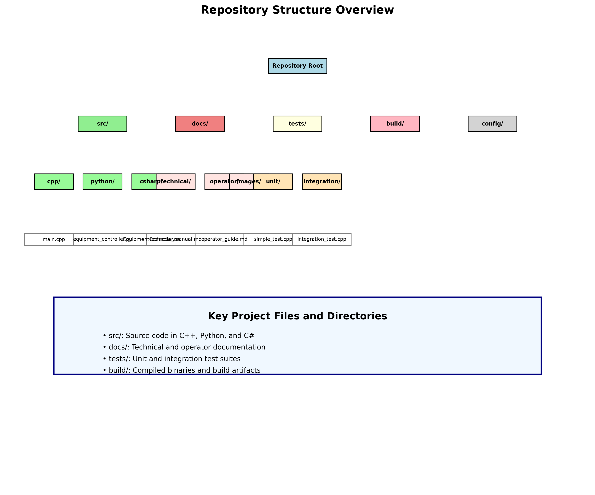

# Installation Guide
## Automated Mechatronic Test Inspection System

### Prerequisites

Before installing the Automated Mechatronic Test Inspection System, ensure you have the following prerequisites:

#### System Requirements
- **Operating System**: Linux (Ubuntu 18.04+ recommended), Windows 10+, or macOS 10.14+
- **Memory**: Minimum 4GB RAM, 8GB+ recommended
- **Storage**: At least 2GB free disk space
- **CPU**: Intel i3 or equivalent (i5+ recommended for optimal performance)

#### Software Dependencies
- **CMake**: Version 3.16 or higher
- **GCC/Clang**: C++17 compatible compiler
- **Python**: Version 3.8 or higher
- **Git**: For source code management

### Installation Steps

#### Step 1: Clone the Repository

```bash
git clone https://github.com/riteshr19/-Automated-Mechatronic-Test-Inspection-System.git
cd -Automated-Mechatronic-Test-Inspection-System
```



#### Step 2: Install System Dependencies

**Ubuntu/Debian:**
```bash
sudo apt-get update
sudo apt-get install build-essential cmake libssl-dev python3 python3-pip
```

**CentOS/RHEL:**
```bash
sudo yum groupinstall "Development Tools"
sudo yum install cmake openssl-devel python3 python3-pip
```

**Windows:**
- Install Visual Studio 2019 or later with C++ development tools
- Install CMake from https://cmake.org/download/
- Install Python from https://python.org/downloads/

#### Step 3: Install Python Dependencies

```bash
pip3 install -r requirements.txt
```

#### Step 4: Build the System

Create build directory and configure:
```bash
mkdir build
cd build
cmake ..
```


Compile the project:
```bash
make -j$(nproc)
```


#### Step 5: Run Tests

Execute unit tests:
```bash
make test
```


#### Step 6: Install the System

```bash
sudo make install
```

### Verification

After installation, verify the system is working correctly:

#### Check Installation
```bash
mechatronic_test_system --help
```

Expected output:
```
=== Automated Mechatronic Test Inspection System ===
Version 1.0.0
Copyright 2024 - Mechatronic Test System Team

Automated Mechatronic Test Inspection System
Usage: mechatronic_test_system [options]
Options:
  -p, --port <port>     Serial port (default: COM1 on Windows, /dev/ttyUSB0 on Linux)
  -b, --baud <rate>     Baud rate (default: 115200)
  -t, --test <device>   Run test on specified device
  -c, --calibrate       Perform equipment calibration
  -s, --status          Show equipment status
  -h, --help            Show this help message
```

#### Check System Status
```bash
mechatronic_test_system --status
```


### Configuration

#### Basic Configuration
The system configuration is located in `config/system.conf`. Default settings include:

```ini
[hardware]
default_port=/dev/ttyUSB0
default_baud=115200
timeout_ms=5000

[testing]
simulation_mode=true
log_level=INFO
max_retries=3

[safety]
emergency_stop_enabled=true
watchdog_timeout=30
```

#### Hardware Setup

1. **Connect Equipment**: Connect your mechatronic devices via USB/Serial
2. **Verify Connections**: Check device permissions
   ```bash
   ls -la /dev/ttyUSB*
   sudo chmod 666 /dev/ttyUSB0  # If needed
   ```
3. **Test Communication**: 
   ```bash
   mechatronic_test_system --port /dev/ttyUSB0 --status
   ```

### Troubleshooting

#### Common Issues

**Build Errors:**
- Ensure CMake version is 3.16+: `cmake --version`
- Check compiler version: `gcc --version` or `clang --version`
- Install missing dependencies as shown in Step 2

**Permission Errors:**
```bash
# For USB/Serial device access
sudo usermod -a -G dialout $USER
# Log out and log back in
```

**Python Module Issues:**
```bash
# Reinstall requirements
pip3 install --upgrade -r requirements.txt
```

### Next Steps

After successful installation:

1. **Read the [Operator Guide](operator/operator_guide.md)** for daily operation procedures
2. **Review the [Technical Manual](technical/technical_manual.md)** for detailed system information
3. **Configure your hardware** according to your specific testing requirements
4. **Run initial calibration** using `mechatronic_test_system --calibrate`

### Support

For installation support:
- Check the [Troubleshooting Guide](technical/technical_manual.md#troubleshooting)
- Review [Known Issues](https://github.com/riteshr19/-Automated-Mechatronic-Test-Inspection-System/issues)
- Contact the development team

---

*Installation Guide Version: 1.0*  
*Last Updated: 2024*