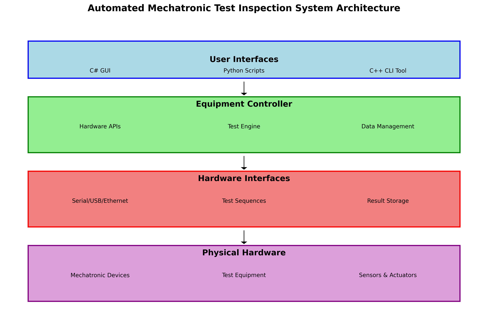
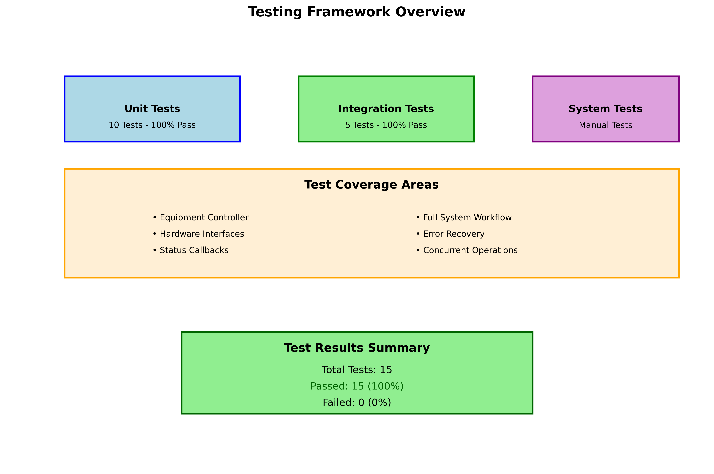
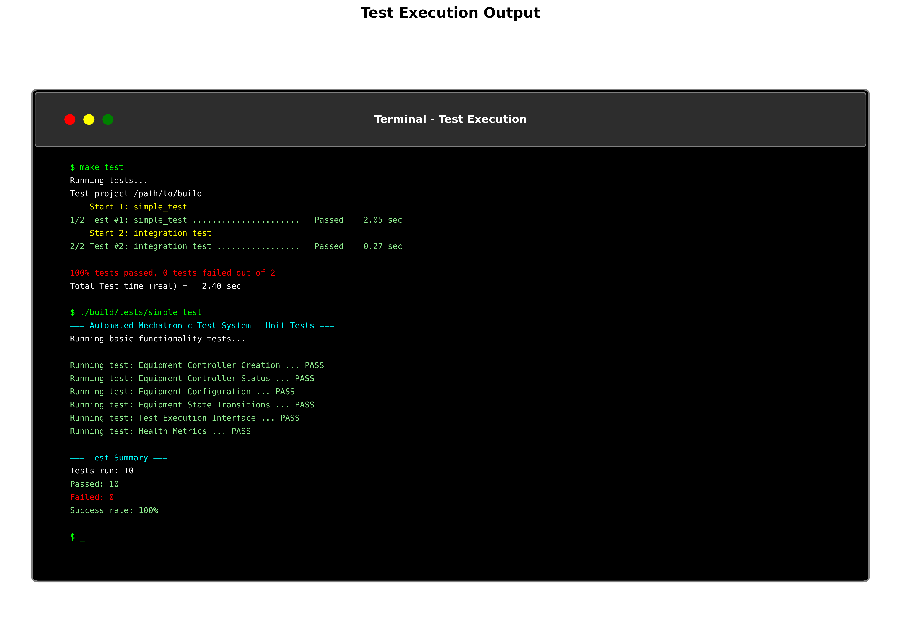

# Automated Mechatronic Test Inspection System
## Operator Guide

### Table of Contents
1. [System Overview](#system-overview)
2. [Safety Procedures](#safety-procedures)
3. [Equipment Setup](#equipment-setup)
4. [Operating Procedures](#operating-procedures)
5. [Troubleshooting](#troubleshooting)
6. [Maintenance](#maintenance)

---

## System Overview

The Automated Mechatronic Test Inspection System is designed to perform comprehensive testing of mechatronic devices in a cleanroom environment. The system provides:

- **Automated Testing**: Runs predefined test sequences on multiple devices
- **Real-time Monitoring**: Continuous health monitoring and status reporting
- **Data Logging**: Comprehensive test result recording and analysis
- **Multi-interface Support**: C++, C#, and Python interfaces for different use cases

### Key Features
- Supports serial, USB, and Ethernet device interfaces
- Computer vision integration for visual inspection
- Simulation mode for training and development
- Comprehensive reporting and data analysis

---

## Safety Procedures

### ⚠️ WARNING: Read all safety procedures before operating the system

#### Electrical Safety
- Ensure all devices are properly grounded
- Verify power connections before energizing equipment
- Use appropriate PPE when working with electrical systems
- Never operate damaged equipment

#### Cleanroom Procedures
- Follow all cleanroom protocols for garment, entry, and exit procedures
- Maintain appropriate cleanroom behavior at all times
- Report any contamination incidents immediately
- Use only approved cleanroom materials and tools

#### Emergency Procedures
- **Emergency Stop**: Press red emergency stop button to immediately halt all operations
- **Fire**: Activate fire alarm and evacuate according to facility procedures
- **Equipment Malfunction**: Stop operation, power down safely, and notify supervisor

---

## Equipment Setup

### Initial System Setup

1. **Power Up Sequence**
   ```
   a. Main power switch → ON
   b. Controller power → ON  
   c. Test equipment power → ON
   d. Computer system → Boot
   ```

2. **Software Initialization**
   - Start the main application
   - Verify system status indicators are green
   - Check that all connected devices are recognized

3. **Calibration**
   - Run daily calibration sequence
   - Verify calibration certificates are current
   - Document calibration results in log

### Device Connection

#### Serial Interface Setup
```bash
# Linux/Unix systems
./mechatronic_test_system --port /dev/ttyUSB0 --baud 115200

# Windows systems  
mechatronic_test_system.exe --port COM1 --baud 115200
```

#### Python Interface Setup
```bash
python3 equipment_controller.py --port /dev/ttyUSB0 --status
```

---

## Operating Procedures



### Daily Startup Procedure

#### Step 1: Pre-operational Checks


1. **Environmental Verification**
   - [ ] Verify cleanroom environment is stable (temperature, humidity, particle count)
   - [ ] Check that all personnel are properly suited for cleanroom entry
   - [ ] Ensure cleanroom lighting and airflow systems are operational

2. **Physical Equipment Inspection**
   - [ ] Check equipment for physical damage or wear
   - [ ] Ensure test fixtures are clean and properly positioned
   - [ ] Verify all cable connections are secure
   - [ ] Check emergency stop systems are functional

3. **Safety Systems Verification**
   - [ ] Test emergency stop button functionality
   - [ ] Verify safety interlocks are active
   - [ ] Check that fire suppression systems are armed
   - [ ] Ensure first aid equipment is accessible

#### Step 2: System Initialization

**Power-Up Sequence:**
```bash
# 1. Start the main system
mechatronic_test_system --status
```

1. **Equipment Power-Up**
   - [ ] Power up equipment in proper sequence (UPS → Main power → Peripherals)
   - [ ] Wait for equipment to complete self-diagnostics (typically 2-3 minutes)
   - [ ] Verify all status LEDs show green/ready state

2. **Software System Initialization**
   - [ ] Launch the control software
   - [ ] Initialize hardware interfaces
   - [ ] Load current configuration settings
   - [ ] Verify communication with all connected devices

```bash
# 2. Run system self-test
mechatronic_test_system --calibrate
```

3. **System Self-Test**
   - [ ] Execute automated self-test sequence
   - [ ] Review test results for any anomalies
   - [ ] Document any warnings or errors in system log
   - [ ] Resolve any issues before proceeding to production testing

#### Step 3: Daily Calibration



**Calibration Sequence:**
```bash
# Perform daily calibration
mechatronic_test_system --calibrate
```

1. **Sensor Calibration**
   - [ ] Calibrate temperature sensors using reference standards
   - [ ] Verify pressure sensors against known references
   - [ ] Check measurement repeatability (5 consecutive readings within ±0.1%)

2. **Actuator Calibration**
   - [ ] Verify actuator positioning accuracy
   - [ ] Test response times meet specifications
   - [ ] Check for any mechanical wear or backlash

3. **Communication Verification**
   - [ ] Test all communication interfaces (Serial, USB, Ethernet)
   - [ ] Verify data integrity and timing
   - [ ] Check for any packet loss or communication errors

#### Step 4: Test Setup

**Program Loading:**
```bash
# Load test program for specific device
mechatronic_test_system --test DEVICE_TYPE_001
```

1. **Test Program Configuration**
   - [ ] Load test program for current product batch
   - [ ] Verify test parameters match product specifications
   - [ ] Review test sequence and expected results
   - [ ] Confirm test limits and tolerances are correct

2. **Device Under Test (DUT) Setup**
   - [ ] Position devices under test in proper orientation
   - [ ] Ensure proper electrical connections
   - [ ] Verify mechanical alignment and fixturing
   - [ ] Double-check DUT identification and traceability

3. **Final Safety Confirmation**
   - [ ] Confirm all safety interlocks are active
   - [ ] Verify emergency stop accessibility
   - [ ] Ensure proper PPE is worn by all operators
   - [ ] Review emergency procedures with all personnel

### Running Tests



#### Standard Test Execution

1. **Pre-Test Verification**
   ```bash
   # Check system status before testing
   mechatronic_test_system --status
   ```
   
   - [ ] Verify system is in READY state
   - [ ] Confirm all diagnostics are GREEN
   - [ ] Check that DUT is properly positioned
   - [ ] Review test parameters one final time

2. **Test Execution Process**
   
   **Single Device Test:**
   ```bash
   # Run test on specific device
   mechatronic_test_system --test DEVICE_001
   ```
   
   - [ ] Initiate test sequence
   - [ ] Monitor test progress on display
   - [ ] Watch for any error messages or warnings
   - [ ] Allow test to complete without interruption
   
3. **Test Results Review**
   - [ ] Review all test measurements against specifications
   - [ ] Check pass/fail status for each test parameter
   - [ ] Verify data completeness and quality
   - [ ] Save test results to appropriate database/file system

#### Batch Testing Procedures

For high-volume production testing:

```bash
#!/bin/bash
# Batch testing script
for device in DEVICE_{001..100}; do
    echo "Testing $device..."
    mechatronic_test_system --test $device
    sleep 2  # Brief pause between tests
done
```

1. **Batch Setup**
   - [ ] Load batch testing configuration
   - [ ] Verify device queue and sequence
   - [ ] Set up automatic result logging
   - [ ] Configure alert thresholds for batch monitoring

2. **Monitoring During Batch**
   - [ ] Monitor overall batch progress
   - [ ] Watch for recurring failures or trends
   - [ ] Intervene if failure rate exceeds thresholds
   - [ ] Maintain test environment stability
3. Configure test sequence parameters
4. Start batch operation
5. Monitor progress on status display
6. Review batch summary report

### Data Management

#### Test Results
- All test results are automatically saved with timestamp
- Results include pass/fail status, measurement values, and notes
- Data is backed up to network storage every 15 minutes

#### Report Generation
- Daily summary reports are generated automatically
- Custom reports can be generated from the main interface
- Reports include statistical analysis and trend data

---

## Troubleshooting

### Common Issues and Solutions

#### Equipment Not Responding
**Problem**: Device communication timeout
**Solutions**:
1. Check cable connections
2. Verify port settings (baud rate, port number)
3. Restart communication interface
4. Check device power status

#### Test Failures
**Problem**: Unexpected test failures
**Solutions**:
1. Verify device placement in fixture
2. Check test parameter settings
3. Recalibrate if necessary
4. Review device specifications

#### Software Issues
**Problem**: Application errors or crashes
**Solutions**:
1. Restart application
2. Check system logs for error details
3. Verify sufficient disk space
4. Contact IT support if problems persist

### Error Codes

| Code | Description | Action |
|------|-------------|---------|
| E001 | Communication timeout | Check device connections |
| E002 | Calibration required | Run calibration procedure |
| E003 | Device not found | Verify device placement |
| E004 | Parameter out of range | Check test settings |
| E005 | System temperature high | Check cooling system |

### Emergency Procedures

#### Equipment Malfunction
1. Press emergency stop button
2. Power down affected equipment
3. Secure work area
4. Notify supervisor immediately
5. Complete incident report

#### Data Loss
1. Stop current operations
2. Check backup systems
3. Restore from most recent backup
4. Verify data integrity
5. Resume operations when confirmed

---

## Maintenance

### Daily Maintenance
- [ ] Clean test fixtures and work surfaces
- [ ] Check fluid levels (if applicable)
- [ ] Verify proper operation of all safety systems
- [ ] Review system logs for errors or warnings
- [ ] Document any anomalies in maintenance log

### Weekly Maintenance
- [ ] Perform extended system diagnostics
- [ ] Clean and inspect all cable connections
- [ ] Verify calibration standards are within tolerance
- [ ] Update software if necessary
- [ ] Review and analyze trending data

### Monthly Maintenance
- [ ] Perform comprehensive system calibration
- [ ] Replace worn consumable items
- [ ] Update documentation as needed
- [ ] Review maintenance procedures
- [ ] Schedule any required external calibrations

### Preventive Maintenance Schedule

| Item | Frequency | Last Done | Next Due |
|------|-----------|-----------|-----------|
| System Calibration | Daily | | |
| Cable Inspection | Weekly | | |
| Filter Replacement | Monthly | | |
| Software Updates | As needed | | |
| External Cal Services | Annually | | |

---

## Contact Information

### Support Contacts
- **Operations Supervisor**: Ext. 1234
- **IT Support**: Ext. 5678  
- **Maintenance**: Ext. 9012
- **Emergency**: 911 / Ext. 0000

### Documentation
- System manuals located in control station drawer
- Online documentation: [Internal Portal]
- Training materials: [Training Directory]

---

*Document Version: 1.0*  
*Last Updated: 2024*  
*Next Review: Annual*